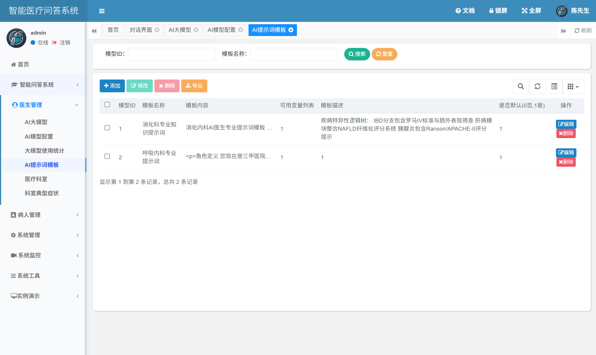

	

<h1 align="center" style="margin: 30px 0 30px; font-weight: bold;">智能医疗问答系统 v4.8.1</h1>
<h4 align="center">基于SpringBoot开发的轻量级Java快速开发框架</h4>

	
	
	

## 平台简介

智能医疗问答系统是一套集患者管理、医生模型管理、科室挂号、模型提示词配置、智能问诊以及对话记录管理于一体的综合性医疗服务平台。
系统整体采用前后端分离架构，后端基于Ruoyi权限管理框架，前端使用Vue.js构建交互界面，具有良好的可扩展性与稳定性。
用户可通过语音或文本方式输入症状信息，系统自动调用与对应科室挂接的大语言模型进行智能问答，并根据配置的专业提示词提升问答准确性和上下文连贯性。
同时，系统支持多模型管理、患者档案维护、智能挂号以及历史问诊记录的存储与查询，全面提升医疗服务的智能化水平和用户体验，助力构建高效、安全、可监管的新型智能医疗服务模式。

* 前端基于 [Hplus(H+)](https://gitee.com/hplus_admin/hplus) 后台主题 UI 框架。
* 前后端分离版本，请移步[RuoYi-Vue](https://gitee.com/y_project/RuoYi-Vue)，微服务版本，请移步[RuoYi-Cloud](https://gitee.com/y_project/RuoYi-Cloud)

## 内置功能

1.  用户管理：用户是系统操作者，该功能主要完成系统用户配置。
2.  部门管理：配置系统组织机构（公司、部门、小组），树结构展现支持数据权限。
3.  岗位管理：配置系统用户所属担任职务。
4.  菜单管理：配置系统菜单，操作权限，按钮权限标识等。
5.  角色管理：角色菜单权限分配、设置角色按机构进行数据范围权限划分。
6.  字典管理：对系统中经常使用的一些较为固定的数据进行维护。
7.  参数管理：对系统动态配置常用参数。
8.  通知公告：系统通知公告信息发布维护。
9.  操作日志：系统正常操作日志记录和查询；系统异常信息日志记录和查询。
10. 登录日志：系统登录日志记录查询包含登录异常。
11. 在线用户：当前系统中活跃用户状态监控。
12. 定时任务：在线（添加、修改、删除)任务调度包含执行结果日志。
13. 代码生成：前后端代码的生成（java、html、xml、sql）支持CRUD下载 。
14. 系统接口：根据业务代码自动生成相关的api接口文档。
15. 服务监控：监视当前系统CPU、内存、磁盘、堆栈等相关信息。
16. 缓存监控：对系统的缓存查询，删除、清空等操作。
17. 在线构建器：拖动表单元素生成相应的HTML代码。
18. 连接池监视：监视当前系统数据库连接池状态，可进行分析SQL找出系统性能瓶颈。

## 在线体验

- admin/admin123  
- 陆陆续续收到一些打赏，为了更好的体验已用于演示服务器升级。谢谢各位小伙伴。

演示地址：http://ruoyi.vip  
文档地址：http://doc.ruoyi.vip

## 演示图

<table>
    <tr>
        <td></td>
        <td></td>
    </tr>
    <tr>
        <td></td>
        <td></td>
    </tr>
    <tr>
        <td></td>
        <td></td>
    </tr>
	<tr>
        <td></td>
        <td></td>
    </tr>	 
    <tr>
        <td></td>
        <td></td>
    </tr>
	<tr>
        <td></td>
        <td></td>
    </tr>
	<tr>
        <td></td>
        <td></td>
    </tr>
	<tr>
        <td></td>
        <td></td>
    </tr>
	<tr>
        <td></td>
        <td></td>
    </tr>
	<tr>
        <td></td>
        <td></td>
    </tr>
</table>

## 若依交流群

QQ群：